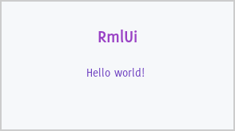

# RmlUi - The HTML/CSS User Interface Library Evolved


RmlUi - now with added boosters taking control of the rocket, targeting *your* games and applications.

---

[](https://gitter.im/RmlUi/community?utm_source=badge&utm_medium=badge&utm_campaign=pr-badge)
[](https://github.com/mikke89/RmlUi/actions/workflows/build.yml)
[](https://ci.appveyor.com/project/mikke89/rmlui/branch/master)

RmlUi is the C++ user interface package based on the HTML and CSS standards, designed as a complete solution for any project's interface needs. It is a fork of the [libRocket](https://github.com/libRocket/libRocket) project, introducing new features, bug fixes, and performance improvements. 

RmlUi aims at being a light-weight and performant library with its own layouting engine and few dependencies. In essence, RmlUi takes your HTML/CSS-like source files and turns them into vertices, indices and draw commands, and then you bring your own renderer to draw them. And of course there is full access to the element hierarchy/DOM, event handling, and all the interactivity and customizability you would expect. All of this directly from C++, or optionally from scripting languages using plugins. The core library compiles down to fractions of the size it takes to integrate a fully fledged web browser. 

RmlUi is based around the XHTML1 and CSS2 standards while borrowing features from HTML5 and CSS3, and extends them with features suited towards real-time applications. Take a look at the [conformance](#conformance) and [enhancements](#enhancements) sections below for details.

Documentation is located at https://mikke89.github.io/RmlUiDoc/

## Features

- Cross platform architecture: Windows, macOS, Linux, iOS, etc.
- Dynamic layout system.
- Full animation and transform support.
- Efficient application-wide styling, with a custom-built templating engine.
- Fully featured control set: buttons, sliders, drop-downs, etc.
- Runtime visual debugging suite.

## Extensible

- Abstracted interfaces for plugging in to any game engine.
- Decorator engine allowing custom application-specific effects that can be applied to any element.
- Generic event system that binds seamlessly into existing projects.
- Easily integrated and extensible with the Lua scripting plugin.

## Controllable

- The user controls their own update loop, calling into RmlUi as desired.
- The library strictly runs as a result of calls to its API, never in the background.
- Input handling and rendering is performed by the user.
- The library generates vertices, indices, and textures for the user to render how they like.
- File handling and the font engine can optionally be fully replaced by the user.


## Conformance

RmlUi aims to support the most common and familiar features from HTML and CSS, while keeping the library light and performant. We do not aim to be fully compliant with CSS or HTML, in particular when it conflicts with lightness and performance. Users are generally expected to author documents specifically for RmlUi, but any experience and skills from web design should be transferable.

RmlUi supports most of CSS2 with some CSS3 features such as

- Animations and transitions
- Transforms (with full interpolation support)
- Flexbox layout
- Media queries
- Border radius

and many of the common HTML elements including `<input>`,  `<textarea>`, and `<select>`.

For details, see
- [RCSS Property index](https://mikke89.github.io/RmlUiDoc/pages/rcss/property_index.html) for all supported properties and differences from CSS.
- [RML Element index](https://mikke89.github.io/RmlUiDoc/pages/rml/element_index.html) for all supported elements.

## Enhancements

RmlUi adds features and enhancements over CSS and HTML where it makes sense, most notably the following.

- [Data binding (model-view-controller)](https://mikke89.github.io/RmlUiDoc/pages/data_bindings.html). Synchronization between application data and user interface.
- [Decorators](https://mikke89.github.io/RmlUiDoc/pages/rcss/decorators.html). Full control over the styling of [all elements](https://mikke89.github.io/RmlUiDoc/pages/style_guide.html).
- [Sprite sheets](https://mikke89.github.io/RmlUiDoc/pages/rcss/sprite_sheets.html). Define and use sprites with easy high DPI support.
- [Templates](https://mikke89.github.io/RmlUiDoc/pages/rml/templates.html). Making windows look consistent.
- [Localization](https://mikke89.github.io/RmlUiDoc/pages/localisation.html). Translate any text in the document.


## Dependencies

- [FreeType](https://www.freetype.org/). However, it can be fully replaced by a custom [font engine](Include/RmlUi/Core/FontEngineInterface.h).
- The standard library.

In addition, a C++14 compatible compiler is required.


## Building RmlUi

RmlUi is built using CMake and your favorite compiler, see the [building documentation](https://mikke89.github.io/RmlUiDoc/pages/cpp_manual/building_with_cmake.html) for all the details and options. Windows binaries are also available for the [latest release](https://github.com/mikke89/RmlUi/releases/latest). Most conveniently, it is possible to fetch the library using a dependency manager such as [vcpkg](https://vcpkg.io/en/getting-started.html) or [Conan](https://conan.io/).

#### vcpkg

```
vcpkg install rmlui
```

That's it! See below for details on integrating RmlUi.

To build RmlUi with the included samples we can use git and CMake together with vcpkg to handle the dependency.

```
vcpkg install freetype
git clone https://github.com/mikke89/RmlUi.git
cd RmlUi
cmake -B Build -S . -DBUILD_SAMPLES=ON -DCMAKE_TOOLCHAIN_FILE="<path-to-vcpkg>/scripts/buildsystems/vcpkg.cmake"
cmake --build Build
```
Make sure to replace the path to vcpkg. When this completes, feel free to test the freshly built samples, such as the `invader` sample, and enjoy! The executables should be located somewhere in the `Build` directory.

#### Conan

RmlUi is readily available from [ConanCenter](https://conan.io/center/recipes/rmlui).


## Integrating RmlUi

Here are the general steps to integrate the library into a C++ application, have a look at the [integration documentation](https://mikke89.github.io/RmlUiDoc/pages/cpp_manual/integrating.html) for details.

1. Build RmlUi as above or fetch the binaries, and [link it up](https://mikke89.github.io/RmlUiDoc/pages/cpp_manual/integrating.html#setting-up-the-build-environment) to your application.
2. Implement the abstract [system interface](Include/RmlUi/Core/SystemInterface.h) and [render interface](Include/RmlUi/Core/RenderInterface.h), or fetch one of the backends listed below.
3. Initialize RmlUi with the interfaces, create a context, provide font files, and load a document.
4. Call into the context's update and render methods in a loop, and submit input events.
5. Compile and run!

Several [samples](Samples/) demonstrate everything from basic integration to more complex use of the library, feel free to have a look for inspiration.


## RmlUi Backends

To ease the integration of RmlUi, the library includes [many backends](Backends/) adding support for common renderers and platforms. The following terms are used here:

- ***Renderer***: Implements the [render interface](https://mikke89.github.io/RmlUiDoc/pages/cpp_manual/interfaces/render.html) for a given rendering API, and provides initialization code when necessary.
- ***Platform***: Implements the [system interface](https://mikke89.github.io/RmlUiDoc/pages/cpp_manual/interfaces/system.html) for a given platform (operating system or window library), and adds procedures for providing input to RmlUi contexts.
- ***Backend***: Combines a renderer and a platform for a complete windowing framework sample, implementing the basic [Backend interface](Backends/RmlUi_Backend.h).

The provided renderers and platforms are intended to be usable as-is by client projects without modifications, thereby circumventing the need to write custom interfaces. We encourage users to only make changes here when they are useful to all users, and then contribute back to the project. However, if they do not meet your needs it is also possible to copy them into your project for modifications. Feedback is welcome to find the proper abstraction level. The provided system and render interfaces are designed such that they can be derived from and further customized by the backend or end user.

The provided backends on the other hand are not intended to be used directly by client projects, but rather copied and modified as needed. They are intentionally light-weight and implement just enough functionality to make the [included samples](Samples/) run, while being simple to understand and build upon by users. See the manual for [backend integration details](https://mikke89.github.io/RmlUiDoc/pages/cpp_manual/integrating.html#backends).

### Renderers

| Renderer features | Basic rendering | Stencil | Transforms | Built-in image support                                                          |
|-------------------|:---------------:|---------|:----------:|---------------------------------------------------------------------------------|
| OpenGL 2 (GL2)    |        ✔️       |    ✔️    |      ✔️    | Uncompressed TGA                                                                |
| OpenGL 3 (GL3)    |        ✔️       |    ✔️    |      ✔️    | Uncompressed TGA                                                                |
| Vulkan (VK)       |        ✔️       |    ✔️    |      ✔️    | Uncompressed TGA                                                                |
| SDLrenderer       |        ✔️       |    ❌    |      ❌    | Based on [SDL_image](https://wiki.libsdl.org/SDL_image/FrontPage) |

**Basic rendering**: Render geometry with colors, textures, and rectangular clipping (scissoring). Sufficient for basic 2d-layouts.\
**Stencil**: Enables proper clipping when transforms are enabled.\
**Transforms**: Enables the `transform` and `perspective` properties to take effect.\
**Built-in image support**: This only shows the supported formats built-in to the renderer, users are encouraged to derive from and extend the render interface to add support for their desired image formats.

### Platforms

| Platform support | Basic windowing | Clipboard | High DPI | Comments                                          |
|------------------|:---------------:|:---------:|:----------:|---------------------------------------------------|
| Win32            |        ✔️        |     ✔️     |     ✔️    | High DPI only supported on Windows 10 and newer.  |
| X11              |        ✔️        |     ✔️     |     ❌    |                                                   |
| SFML             |        ✔️        |     ⚠️     |     ❌    | Some issues with Unicode characters in clipboard. |
| GLFW             |        ✔️        |     ✔️     |     ✔️    |                                                   |
| SDL              |        ✔️        |     ✔️     |     ❌    |                                                   |

**Basic windowing**: Open windows, react to resize events, submit inputs to the RmlUi context.\
**Clipboard**: Read from and write to the system clipboard.\
**High DPI**: Scale the [dp-ratio](https://mikke89.github.io/RmlUiDoc/pages/rcss/syntax#dp-unit) of RmlUi contexts based on the monitor's DPI settings. React to DPI-changes, either because of changed settings or when moving the window to another monitor.

### Backends

| Platform \ Renderer | OpengGL 2 | OpengGL 3 | Vulkan | SDLrenderer |
|---------------------|:---------:|:---------:|:---------:|:-----------:|
| Win32               |     ✔️     |           |    ✔️     |             |
| X11                 |     ✔️     |           |          |             |
| SFML                |     ✔️     |           |          |             |
| GLFW                |     ✔️     |     ✔️    |     ✔️    |             |
| SDL¹                |     ✔️     |     ✔️²   |     ✔️    |      ✔️     |

¹ SDL backends extend their respective renderers to provide image support based on SDL_image.\
² Supports Emscripten compilation target.

When building the samples, the backend can be selected by setting the CMake option `SAMPLES_BACKEND` to `<Platform>_<RendererShorthand>` for any of the above supported combinations of platforms and renderers, such as `SDL_GL3`.


## Example document

This example demonstrates a basic document with [data bindings](https://mikke89.github.io/RmlUiDoc/pages/data_bindings.html), which is loaded and displayed using the C++ code below.

#### Document

`hello_world.rml`

```html
<rml>
<head>
	<title>Hello world</title>
	<link type="text/rcss" href="rml.rcss"/>
	<link type="text/rcss" href="window.rcss"/>
</head>
<body data-model="animals">
	<h1>RmlUi</h1>
	<p>Hello <span id="world">world</span>!</p>
	<p data-if="show_text">The quick brown fox jumps over the lazy {{animal}}.</p>
	<input type="text" data-value="animal"/>
</body>
</rml>
```
The `{{animal}}` text and the `data-if`, `data-value` attributes represent data bindings and will synchronize with the application data.

#### Style sheet

`window.rcss`

```css
body {
	font-family: LatoLatin;
	font-size: 18px;
	color: #02475e;
	background: #fefecc;
	text-align: center;
	padding: 2em 1em;
	position: absolute;
	border: 2px #ccc;
	width: 500px;
	height: 200px;
	margin: auto;
}
		
h1 {
	color: #f6470a;
	font-size: 1.5em;
	font-weight: bold;
	margin-bottom: 0.7em;
}
		
p { 
	margin: 0.7em 0;
}
		
input.text {
	background-color: #fff;
	color: #555;
	border: 2px #999;
	padding: 5px;
	tab-index: auto;
	cursor: text;
	box-sizing: border-box;
	width: 200px;
	font-size: 0.9em;
}
```

RmlUi defines no styles internally, thus the `input` element is styled here, and [`rml.rcss` is included](Samples/assets/rml.rcss) for proper layout of common tags.


#### C++ Initialization and loop

`main.cpp`

```cpp
#include <RmlUi/Core.h>

class MyRenderInterface : public Rml::RenderInterface
{
	// RmlUi sends vertices, indices and draw commands through this interface for your
	// application to render how you'd like.
	/* ... */
}

class MySystemInterface : public Rml::SystemInterface
{	
	// RmlUi requests the current time and provides various utilities through this interface.
	/* ... */
}

struct ApplicationData {
	bool show_text = true;
	Rml::String animal = "dog";
} my_data;

int main(int argc, char** argv)
{
	// Initialize the window and graphics API being used, along with your game or application.

	/* ... */

	MyRenderInterface render_interface;
	MySystemInterface system_interface;

	// Install the custom interfaces.
	Rml::SetRenderInterface(&render_interface);
	Rml::SetSystemInterface(&system_interface);

	// Now we can initialize RmlUi.
	Rml::Initialise();

	// Create a context to display documents within.
	Rml::Context* context = Rml::CreateContext("main", Rml::Vector2i(window_width, window_height));

	// Tell RmlUi to load the given fonts.
	Rml::LoadFontFace("LatoLatin-Regular.ttf");
	// Fonts can be registered as fallback fonts, as in this case to display emojis.
	Rml::LoadFontFace("NotoEmoji-Regular.ttf", true);

	// Set up data bindings to synchronize application data.
	if (Rml::DataModelConstructor constructor = context->CreateDataModel("animals"))
	{
		constructor.Bind("show_text", &my_data.show_text);
		constructor.Bind("animal", &my_data.animal);
	}

	// Now we are ready to load our document.
	Rml::ElementDocument* document = context->LoadDocument("hello_world.rml");
	document->Show();

	// Replace and style some text in the loaded document.
	Rml::Element* element = document->GetElementById("world");
	element->SetInnerRML(reinterpret_cast<const char*>(u8"🌍"));
	element->SetProperty("font-size", "1.5em");

	bool exit_application = false;
	while (!exit_application)
	{
		// We assume here that we have some way of updating and retrieving inputs internally.
		if (my_input->KeyPressed(KEY_ESC))
			exit_application = true;

		// Submit input events such as MouseMove and key events (not shown) to the context.
		if (my_input->MouseMoved())
			context->ProcessMouseMove(mouse_pos.x, mouse_pos.y, 0);

		// Update the context to reflect any changes resulting from input events, animations,
		// modified and added elements, or changed data in data bindings.
		context->Update();

		// Render the user interface. All geometry and other rendering commands are now
		// submitted through the render interface.
		context->Render();
	}

	Rml::Shutdown();

	return 0;
}
```

#### Rendered output



Users can now edit the text field to change the animal. The data bindings ensure that both the document text as well as the application string `my_data.animal` are automatically modified accordingly.


## Gallery

**Game interface from the 'invader' sample**\


**Game menu**\


**Simple game from the 'databinding' sample**\


**[alt:V](https://altv.mp/) installer - a multiplayer client for GTA:V**\


**[Unvanquished](https://unvanquished.net/) - a first-person shooter game with real-time strategy elements - menus and HUD in RmlUi**\


**Installer software by [@xland](https://github.com/xland)**\


**[TruckersMP](https://truckersmp.com/) - a multiplayer mod for truck simulators - chat box in RmlUi**\


**Form controls from the 'demo' sample**\


**Sandbox from the 'demo' sample, try it yourself!**\


**Visual testing framework - for built-in automated layout tests**\


**Flexbox layout**\
  


**Animations and transitions from the 'animation' sample**

[Animation sample](https://user-images.githubusercontent.com/5490330/230486839-de3ca062-6641-48e0-aa6a-ef2b26c3aad5.webm)

\
**Transitions and transforms on a game menu**

[Game main menu](https://user-images.githubusercontent.com/5490330/230487193-cd07b565-2e9b-4570-aa37-7dd7746dd9c9.webm)

\
**Camera movement in a game menu**

[Transforms applied to game menu](https://user-images.githubusercontent.com/5490330/230487217-f499dfca-5304-4b99-896d-07791926da2b.webm)

\
**Transitions on mouse hover (entirely in RCSS)**\
  

**Animated transforms (entirely in RCSS)**\
  

**Vector animations with the [Lottie plugin](https://mikke89.github.io/RmlUiDoc/pages/cpp_manual/lottie.html)**\
  

**Vector images with the [SVG plugin](https://mikke89.github.io/RmlUiDoc/pages/cpp_manual/svg.html)**\
  


See the **[full gallery](https://mikke89.github.io/RmlUiDoc/pages/gallery.html)** for more screenshots and videos of the library in action.


## License

RmlUi is published under the [MIT license](LICENSE.txt). The library includes third-party source code and assets with their own licenses, as detailed below.

#### RmlUi source code and assets

MIT License

Copyright (c) 2008-2014 CodePoint Ltd, Shift Technology Ltd, and contributors\
Copyright (c) 2019-2023 The RmlUi Team, and contributors

Permission is hereby granted, free of charge, to any person obtaining a copy
of this software and associated documentation files (the "Software"), to deal
in the Software without restriction, including without limitation the rights
to use, copy, modify, merge, publish, distribute, sublicense, and/or sell
copies of the Software, and to permit persons to whom the Software is
furnished to do so, subject to the following conditions:

The above copyright notice and this permission notice shall be included in
all copies or substantial portions of the Software.

THE SOFTWARE IS PROVIDED "AS IS", WITHOUT WARRANTY OF ANY KIND, EXPRESS OR
IMPLIED, INCLUDING BUT NOT LIMITED TO THE WARRANTIES OF MERCHANTABILITY,
FITNESS FOR A PARTICULAR PURPOSE AND NONINFRINGEMENT. IN NO EVENT SHALL THE
AUTHORS OR COPYRIGHT HOLDERS BE LIABLE FOR ANY CLAIM, DAMAGES OR OTHER
LIABILITY, WHETHER IN AN ACTION OF CONTRACT, TORT OR OTHERWISE, ARISING FROM,
OUT OF OR IN CONNECTION WITH THE SOFTWARE OR THE USE OR OTHER DEALINGS IN
THE SOFTWARE.

#### Third-party source code included in RmlUi Core

See [Include/RmlUi/Core/Containers/LICENSE.txt](Include/RmlUi/Core/Containers/LICENSE.txt) - all MIT licensed.

#### Third-party font assets included in RmlUi Debugger

See [Source/Debugger/LICENSE.txt](Source/Debugger/LICENSE.txt) - SIL Open Font License.

#### Additional sample assets *(in Samples/)*

See
- [Samples/assets/LICENSE.txt](Samples/assets/LICENSE.txt)
- [Samples/basic/bitmapfont/data/LICENSE.txt](Samples/basic/bitmapfont/data/LICENSE.txt)
- [Samples/basic/harfbuzz/data/LICENSE.txt](Samples/basic/harfbuzz/data/LICENSE.txt)
- [Samples/basic/lottie/data/LICENSE.txt](Samples/basic/lottie/data/LICENSE.txt)
- [Samples/basic/svg/data/LICENSE.txt](Samples/basic/svg/data/LICENSE.txt)

#### Library included with the Vulkan backend *(in Backends/RmlUi_Vulkan/)*

See [Backends/RmlUi_Vulkan/LICENSE.txt](Backends/RmlUi_Vulkan/LICENSE.txt) - MIT licensed.

#### Libraries included with the test suite *(in Tests/Dependencies/)*

See [Tests/Dependencies/LICENSE.txt](Tests/Dependencies/LICENSE.txt).

#### Additional test suite assets *(in Tests/Data/VisualTests/)*

See [Tests/Data/VisualTests/LICENSE.txt](Tests/Data/VisualTests/LICENSE.txt).
